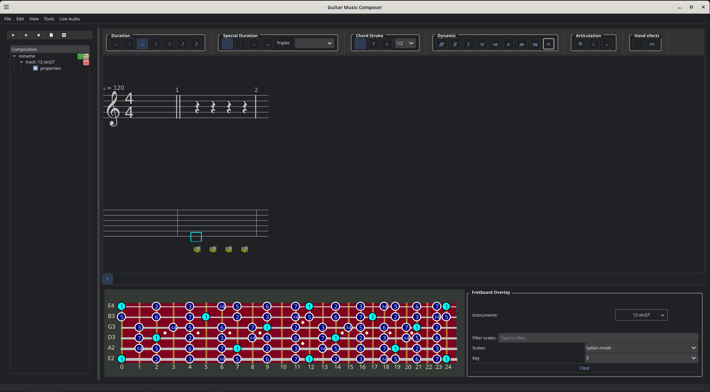
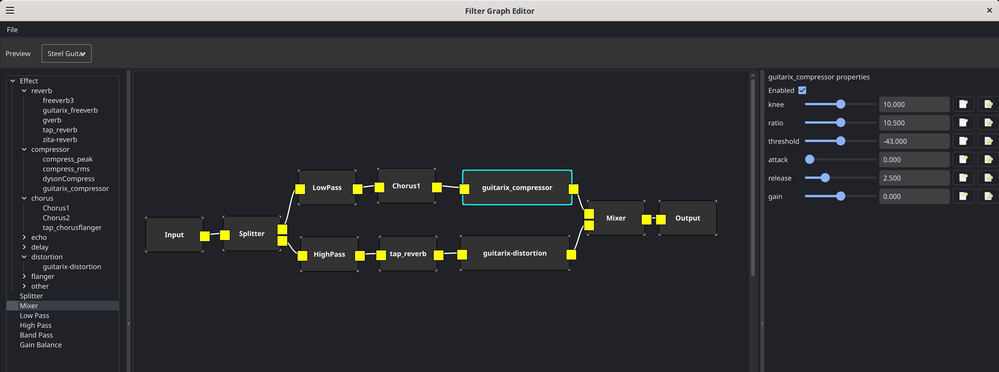
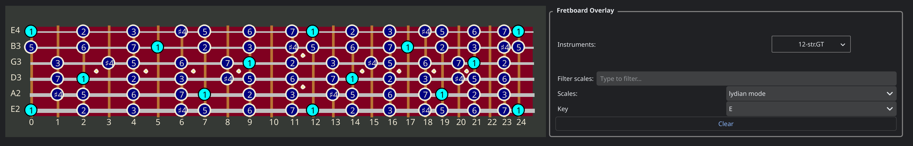
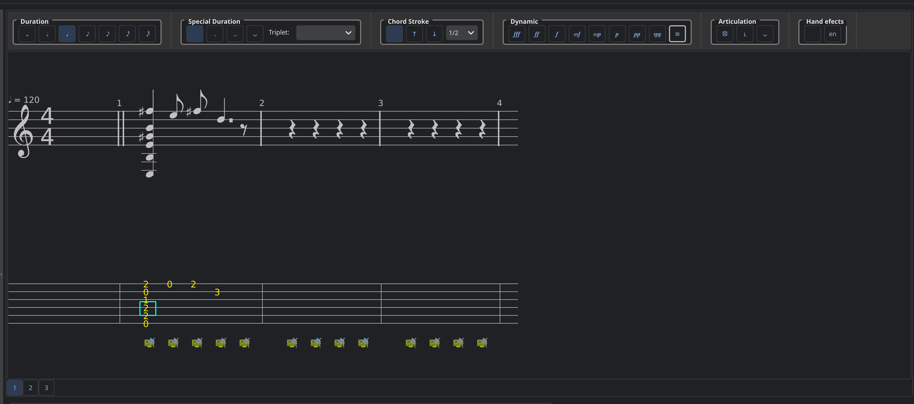

# GuitarComposer
Music composition application  

Guitar Composer is a music composition software aimed at guitar players. Its ultimate goal is to provide per track and event per note effects using a full featured filter graph. The ability to blend different instruments to mimic the polyphonic nature of the guitar in which you can play the same note using different strings to provide color for the notes. GC has the ability to create virtual guitars in which combinations of instruments are assigned to each string, such as making the high E string be a combination of 20% orchestral harp, 10% bell and 70% steel string guitar. 

## Current state

Although 0.1.0 some basic functionality exists: 

- A synth which I reworked from the TingSoundFount library https://github.com/schellingb/TinySoundFont to add per track sound effects using a filter graph that allows for arbitrary ladspa effects to be combined in a audio graph.

- It has a preview screen (An idea I got from TuxGuitar) where the user can test out presets and see scales.

- A directory explorer. Each piece of music is represented as a tree structure. with read track being a branch and a song being a collection of branches. 

- A music editor that is keyboard centric like a MS-Work document (Control-C/V/X copy-paste) the user edits tablature and notes appear on the staff.

- Toolbar that controls dynamic, duration etc. This can also be controlled by the keyboard.   

There are bugs at this stage of development. As a solo project I will work the best I can to fix bugs but I have a day job. 

# Editor

# filter graph 

## Installation, build and run

- source venv/bin/activate
- pip install -r requirements.txt
- ./setup.py build
- ./setup.py install
- python -m guitar_composer.app 

